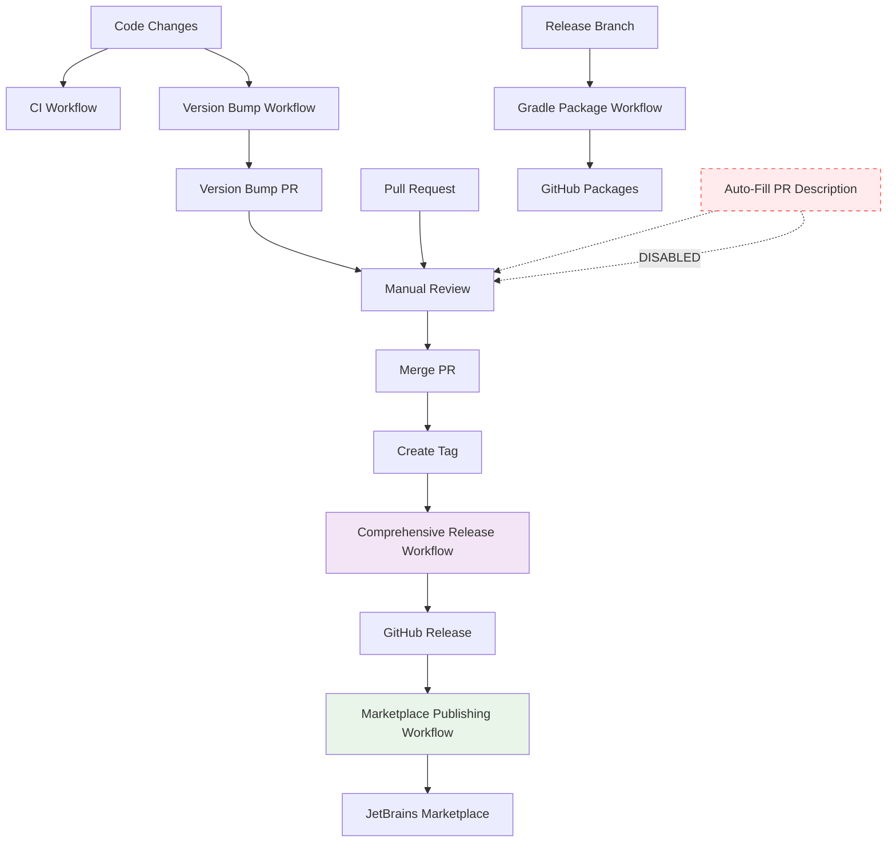
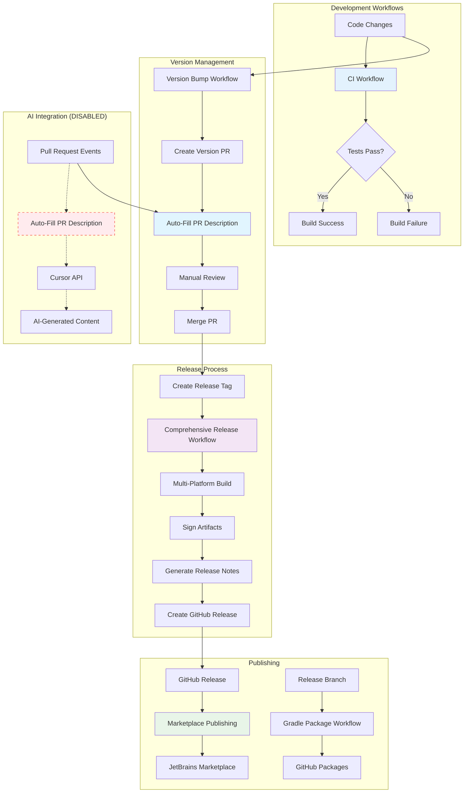

# Release Workflows Documentation

This document describes the comprehensive release workflow system for the Cursor AI IntelliJ Plugin. The system includes automated version management, building, testing, signing, publishing, and distribution.

## Workflow Overview

The release system consists of several interconnected workflows:

1. **Version Bump Workflow** (`version-bump.yml`) - Automated version management
2. **Comprehensive Release Workflow** (`release-comprehensive.yml`) - Full release pipeline
3. **Simple Release Workflow** (`release.yml`) - Legacy simple release
4. **Marketplace Publishing Workflow** (`publish-marketplace.yml`) - JetBrains Marketplace publishing
5. **Gradle Package Workflow** (`gradle-publish.yml`) - Build and package workflow
6. **Auto-Fill PR Description Workflow** (`auto-fill-pr-description.yml.disabled`) - AI-powered PR template population (DISABLED)
7. **CI Workflow** (`ci.yml`) - Continuous integration and testing

## Workflow Details

### 1. Version Bump Workflow (`version-bump.yml`)

**Triggers:**
- Push to `main` or `develop` branches (automatic detection)
- Manual dispatch with version bump type selection

**Features:**
- Automatic version bump detection based on source code changes
- Manual version bump with patch/minor/major selection
- Pull request creation for review
- Version synchronization across all project files
- Version consistency validation

**Usage:**
```bash
# Automatic (triggered by code changes)
git push origin main

# Manual (via GitHub Actions UI)
# Go to Actions → Version Bump → Run workflow
# Select bump type: patch, minor, or major
# Choose whether to create a PR or push directly
```

### 2. Comprehensive Release Workflow (`release-comprehensive.yml`)

**Triggers:**
- Push of version tags (`v*`)
- Manual dispatch with version input

**Features:**
- Multi-platform building (IC and IU)
- Comprehensive testing
- Artifact signing (if signing keys configured)
- Release notes generation
- GitHub release creation
- GitHub Packages publishing
- Artifact distribution

**Usage:**
```bash
# Create and push a version tag
git tag v0.0.6
git push origin v0.0.6

# Manual trigger via GitHub Actions UI
# Go to Actions → Comprehensive Release → Run workflow
# Enter version number (e.g., 0.0.6)
# Optionally create a new tag
```

### 3. Marketplace Publishing Workflow (`publish-marketplace.yml`)

**Triggers:**
- Release published event
- Manual dispatch with version and channel selection

**Features:**
- JetBrains Marketplace publishing
- Multiple channel support (default, beta, alpha)
- Dry run validation
- Marketplace-specific validation

**Usage:**
```bash
# Automatic (triggered by GitHub release)
# Create a release on GitHub, workflow runs automatically

# Manual (via GitHub Actions UI)
# Go to Actions → Publish Marketplace → Run workflow
# Enter version number
# Select channel (default/beta/alpha)
# Choose dry run or actual publishing
```

### 4. Auto-Fill PR Description Workflow (`auto-fill-pr-description.yml.disabled`) - DISABLED

**Status:** DISABLED - This workflow has been disabled and will not run automatically.

**Triggers:**
- Pull request opened or synchronized
- Manual dispatch with PR number input

**Features:**
- AI-powered PR description generation using Cursor API
- Automatic analysis of code changes, commits, and diffs
- Template placeholder replacement
- Context-aware content generation for IntelliJ plugin development

**Usage:**
```bash
# WORKFLOW IS DISABLED - No automatic execution
# To re-enable: rename auto-fill-pr-description.yml.disabled to auto-fill-pr-description.yml

# Manual (via GitHub Actions UI) - Only works if re-enabled
# Go to Actions → Auto-Fill PR Description → Run workflow
# Enter PR number to update
```

**Required Secrets:**
- `CURSOR_API_KEY` - Your Cursor API key for AI content generation

### 5. CI Workflow (`ci.yml`)

**Triggers:**
- Push to `main` or `develop` branches
- Pull requests to `main` branch

**Features:**
- Multi-platform testing (IC and IU)
- Comprehensive test execution
- Build verification
- Artifact upload for review

**Usage:**
```bash
# Automatic (triggered by code changes)
git push origin main
# or create a pull request

# The workflow automatically runs tests and builds
```

### 6. Gradle Package Workflow (`gradle-publish.yml`)

**Triggers:**
- Push to `release/v*` branches
- Pull requests to `main` branch

**Features:**
- Multi-platform building (IC and IU)
- GitHub Packages publishing
- Build artifact management
- Comprehensive testing before packaging

**Usage:**
```bash
# Automatic (triggered by release branch pushes)
git push origin release/v0.0.6

# Manual (via pull request to main)
# Create PR to main branch
```

## Required Secrets

To use the full functionality, configure these repository secrets:

### GitHub Secrets
- `GITHUB_TOKEN` - Automatically provided by GitHub
- `SIGNING_KEY` - GPG private key for artifact signing (optional)
- `SIGNING_KEY_PASSPHRASE` - Passphrase for signing key (optional)

### JetBrains Marketplace Secrets
- `JETBRAINS_MARKETPLACE_TOKEN` - Your JetBrains Marketplace API token
- `JETBRAINS_MARKETPLACE_PLUGIN_ID` - Your plugin ID in the marketplace

### AI Integration Secrets
- `CURSOR_API_KEY` - Your Cursor API key for AI-powered PR description generation

## Setup Instructions

### 1. Configure Repository Secrets

1. Go to your repository → Settings → Secrets and variables → Actions
2. Add the required secrets listed above

### 2. Configure JetBrains Marketplace Publishing

1. Get your marketplace token from [JetBrains Marketplace](https://plugins.jetbrains.com/)
2. Add the token and plugin ID as repository secrets
3. Ensure your `build.gradle.kts` has marketplace publishing configured

### 3. Configure Signing (Optional)

1. Generate a GPG key pair for signing
2. Add the private key and passphrase as repository secrets
3. The workflow will automatically sign artifacts if secrets are present

## Release Process

### Automated Release Process

1. **Develop Features**: Make changes in feature branches
2. **Merge to Main**: Merge feature branches to main
3. **Version Bump**: The version bump workflow automatically detects changes and creates a PR
4. **Review and Merge**: Review the version bump PR and merge it
5. **Create Tag**: Create a version tag (e.g., `v0.0.6`)
6. **Push Tag**: Push the tag to trigger the comprehensive release workflow
7. **Review Release**: The workflow automatically creates a GitHub release
8. **Publish to Marketplace**: Use the marketplace workflow to publish to JetBrains Marketplace

### Manual Release Process

1. **Update Version**: Edit `src/main/resources/META-INF/plugin.xml`
2. **Sync Version**: Run `./sync-version.sh`
3. **Test Build**: Run `./build.sh all`
4. **Create Tag**: `git tag v0.0.6`
5. **Push Tag**: `git push origin v0.0.6`
6. **Monitor Workflows**: Watch the GitHub Actions for completion
7. **Publish to Marketplace**: Use the marketplace workflow

## Workflow Dependencies



## Complete Workflow Overview

The following diagram shows all workflows and their relationships in the Cursor AI IntelliJ Plugin project:



## Artifact Outputs

### Build Artifacts
- `cursor-intellij-plugin-IC-{version}.jar` - Community Edition plugin
- `cursor-intellij-plugin-IU-{version}.jar` - Ultimate Edition plugin
- `cursor-intellij-plugin-IC-{version}.zip` - Community Edition distribution
- `cursor-intellij-plugin-IU-{version}.zip` - Ultimate Edition distribution

### Signed Artifacts (if signing enabled)
- `*.asc` - GPG signature files
- `*.sha256` - SHA256 checksums
- `*.sha512` - SHA512 checksums

## Troubleshooting

### Common Issues

1. **Version Mismatch Error**
   - Ensure `plugin.xml` version matches the release tag
   - Run `./sync-version.sh` to synchronize versions

2. **Marketplace Publishing Fails**
   - Verify `JETBRAINS_MARKETPLACE_TOKEN` is valid
   - Check `JETBRAINS_MARKETPLACE_PLUGIN_ID` is correct
   - Ensure plugin version is unique

3. **Signing Fails**
   - Verify `SIGNING_KEY` and `SIGNING_KEY_PASSPHRASE` are correct
   - Check GPG key format and permissions

4. **Build Fails**
   - Ensure Java 21+ is available
   - Check Gradle wrapper permissions
   - Verify all dependencies are available

5. **Auto-Fill PR Description Fails**
   - Verify `CURSOR_API_KEY` is valid and has proper permissions
   - Check that the PR contains template placeholders
   - Ensure the API key has sufficient credits/quota
   - Check network connectivity to Cursor API

6. **CI Workflow Fails**
   - Verify Java 21+ is available in the runner
   - Check that all tests pass locally
   - Ensure Gradle wrapper is executable
   - Verify platform-specific builds work correctly

### Detailed Troubleshooting Guide

#### Workflow-Specific Issues

**Version Bump Workflow Issues:**
- **"No version bump needed"**: Check if source files actually changed
- **"Version synchronization failed"**: Run `./sync-version.sh` locally first
- **"PR creation failed"**: Verify GitHub token has proper permissions

**Comprehensive Release Workflow Issues:**
- **"Version consistency validation failed"**: Update plugin.xml version manually
- **"Build artifacts not found"**: Check if build steps completed successfully
- **"Release creation failed"**: Verify GitHub token has write permissions

**Marketplace Publishing Issues:**
- **"Marketplace credentials invalid"**: Regenerate token from JetBrains Marketplace
- **"Plugin verification failed"**: Check plugin.xml for required fields
- **"Publishing timeout"**: Increase workflow timeout or check marketplace status

**Auto-Fill PR Description Issues:**
- **"API key not configured"**: Add CURSOR_API_KEY to repository secrets
- **"No template placeholders found"**: Ensure PR uses the template format
- **"AI response invalid"**: Check Cursor API key quota and network connectivity

**CI Workflow Issues:**
- **"Tests failing"**: Run tests locally with `./gradlew test`
- **"Platform build failed"**: Check platform-specific dependencies
- **"Artifact upload failed"**: Verify GitHub Actions permissions

#### Environment and Configuration Issues

**Java Version Issues:**
```bash
# Check Java version
java -version

# Should show Java 21 or later
# If not, install Java 21+ and update JAVA_HOME
```

**Gradle Issues:**
```bash
# Make gradlew executable
chmod +x ./gradlew

# Check Gradle version
./gradlew --version

# Clean and rebuild
./gradlew clean build
```

**Git Configuration Issues:**
```bash
# Configure Git for workflows
git config --global user.name "Your Name"
git config --global user.email "your.email@example.com"

# Check branch and tag status
git branch -a
git tag -l
```

#### Secret Configuration Issues

**Missing Secrets:**
1. Go to repository → Settings → Secrets and variables → Actions
2. Add required secrets:
   - `CURSOR_API_KEY`
   - `JETBRAINS_MARKETPLACE_TOKEN`
   - `JETBRAINS_MARKETPLACE_PLUGIN_ID`
   - `SIGNING_KEY` (optional)
   - `SIGNING_KEY_PASSPHRASE` (optional)

**Invalid Secret Format:**
- **CURSOR_API_KEY**: Should be a valid Cursor API key
- **JETBRAINS_MARKETPLACE_TOKEN**: Should be a 36-character UUID format
- **SIGNING_KEY**: Should be a valid GPG private key

#### Network and API Issues

**API Connectivity:**
```bash
# Test Cursor API connectivity
curl -H "Authorization: Bearer $CURSOR_API_KEY" \
     -H "Content-Type: application/json" \
     https://api.cursor.com/v1/chat/completions

# Test JetBrains Marketplace API
curl -H "Authorization: Bearer $JETBRAINS_MARKETPLACE_TOKEN" \
     https://plugins.jetbrains.com/api/vendor/plugins
```

**Firewall/Proxy Issues:**
- Check if corporate firewall blocks GitHub Actions
- Verify proxy settings if applicable
- Ensure outbound HTTPS connections are allowed

### Debug Mode

Enable debug logging by adding this to workflow steps:
```yaml
env:
  GRADLE_OPTS: "-Dorg.gradle.debug=true"
  DEBUG: "true"
```

## Best Practices

1. **Version Management**
   - Always use semantic versioning (MAJOR.MINOR.PATCH)
   - Update changelog in README.md for each release
   - Test version synchronization before releasing

2. **Release Process**
   - Test builds locally before creating tags
   - Use dry run mode for marketplace publishing initially
   - Monitor workflow execution and fix issues promptly

3. **Security**
   - Keep signing keys secure and rotate regularly
   - Use marketplace tokens with minimal required permissions
   - Review all workflow changes before merging

4. **Documentation**
   - Update this documentation when adding new workflows
   - Document any custom configurations or secrets
   - Keep changelog up to date

## Workflow Customization

### Adding New Platforms

To add support for additional IntelliJ platforms:

1. Update the matrix strategy in `release-comprehensive.yml`
2. Add platform-specific build configurations
3. Update artifact naming conventions

### Custom Signing

To customize signing behavior:

1. Modify the signing step in `release-comprehensive.yml`
2. Add custom signing commands
3. Update artifact upload patterns

### Additional Publishing Targets

To add more publishing targets:

1. Create new workflow files
2. Configure appropriate secrets
3. Add publishing steps to the comprehensive release workflow

## Support

For issues with the release workflows:

1. Check the GitHub Actions logs for detailed error messages
2. Verify all required secrets are configured
3. Test workflows locally using the build scripts
4. Create GitHub issues for workflow bugs or feature requests

## Changelog

### Workflow System v2.0 (Current)
- **AI-Powered PR Management**: Added auto-fill PR description workflow using Cursor API
- **Enhanced CI Pipeline**: Comprehensive CI workflow with multi-platform testing
- **Improved Documentation**: Updated workflow documentation with all current workflows
- **Better Error Handling**: Enhanced troubleshooting guides for all workflows
- **Streamlined Release Process**: Optimized workflow dependencies and execution order

### Workflow System v1.0
- Initial comprehensive release workflow system
- Automated version management
- Multi-platform building and testing
- JetBrains Marketplace publishing
- Artifact signing and distribution
- Comprehensive documentation and troubleshooting guide