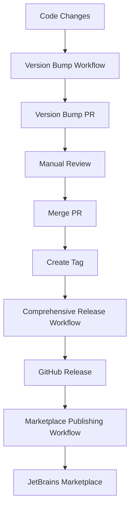

# Release Workflows Documentation

This document describes the comprehensive release workflow system for the Cursor AI IntelliJ Plugin. The system includes automated version management, building, testing, signing, publishing, and distribution.

## Workflow Overview

The release system consists of several interconnected workflows:

1. **Version Bump Workflow** (`version-bump.yml`) - Automated version management
2. **Comprehensive Release Workflow** (`release-comprehensive.yml`) - Full release pipeline
3. **Simple Release Workflow** (`release.yml`) - Legacy simple release
4. **Marketplace Publishing Workflow** (`publish-marketplace.yml`) - JetBrains Marketplace publishing
5. **Gradle Package Workflow** (`gradle-publish.yml`) - Build and package workflow

## Workflow Details

### 1. Version Bump Workflow (`version-bump.yml`)

**Triggers:**
- Push to `main` or `develop` branches (automatic detection)
- Manual dispatch with version bump type selection

**Features:**
- Automatic version bump detection based on source code changes
- Manual version bump with patch/minor/major selection
- Pull request creation for review
- Version synchronization across all project files
- Version consistency validation

**Usage:**
```bash
# Automatic (triggered by code changes)
git push origin main

# Manual (via GitHub Actions UI)
# Go to Actions → Version Bump → Run workflow
# Select bump type: patch, minor, or major
# Choose whether to create a PR or push directly
```

### 2. Comprehensive Release Workflow (`release-comprehensive.yml`)

**Triggers:**
- Push of version tags (`v*`)
- Manual dispatch with version input

**Features:**
- Multi-platform building (IC and IU)
- Comprehensive testing
- Artifact signing (if signing keys configured)
- Release notes generation
- GitHub release creation
- GitHub Packages publishing
- Artifact distribution

**Usage:**
```bash
# Create and push a version tag
git tag v0.0.6
git push origin v0.0.6

# Manual trigger via GitHub Actions UI
# Go to Actions → Comprehensive Release → Run workflow
# Enter version number (e.g., 0.0.6)
# Optionally create a new tag
```

### 3. Marketplace Publishing Workflow (`publish-marketplace.yml`)

**Triggers:**
- Release published event
- Manual dispatch with version and channel selection

**Features:**
- JetBrains Marketplace publishing
- Multiple channel support (default, beta, alpha)
- Dry run validation
- Marketplace-specific validation

**Usage:**
```bash
# Automatic (triggered by GitHub release)
# Create a release on GitHub, workflow runs automatically

# Manual (via GitHub Actions UI)
# Go to Actions → Publish Marketplace → Run workflow
# Enter version number
# Select channel (default/beta/alpha)
# Choose dry run or actual publishing
```

## Required Secrets

To use the full functionality, configure these repository secrets:

### GitHub Secrets
- `GITHUB_TOKEN` - Automatically provided by GitHub
- `SIGNING_KEY` - GPG private key for artifact signing (optional)
- `SIGNING_KEY_PASSPHRASE` - Passphrase for signing key (optional)

### JetBrains Marketplace Secrets
- `JETBRAINS_MARKETPLACE_TOKEN` - Your JetBrains Marketplace API token
- `JETBRAINS_MARKETPLACE_PLUGIN_ID` - Your plugin ID in the marketplace

## Setup Instructions

### 1. Configure Repository Secrets

1. Go to your repository → Settings → Secrets and variables → Actions
2. Add the required secrets listed above

### 2. Configure JetBrains Marketplace Publishing

1. Get your marketplace token from [JetBrains Marketplace](https://plugins.jetbrains.com/)
2. Add the token and plugin ID as repository secrets
3. Ensure your `build.gradle.kts` has marketplace publishing configured

### 3. Configure Signing (Optional)

1. Generate a GPG key pair for signing
2. Add the private key and passphrase as repository secrets
3. The workflow will automatically sign artifacts if secrets are present

## Release Process

### Automated Release Process

1. **Develop Features**: Make changes in feature branches
2. **Merge to Main**: Merge feature branches to main
3. **Version Bump**: The version bump workflow automatically detects changes and creates a PR
4. **Review and Merge**: Review the version bump PR and merge it
5. **Create Tag**: Create a version tag (e.g., `v0.0.6`)
6. **Push Tag**: Push the tag to trigger the comprehensive release workflow
7. **Review Release**: The workflow automatically creates a GitHub release
8. **Publish to Marketplace**: Use the marketplace workflow to publish to JetBrains Marketplace

### Manual Release Process

1. **Update Version**: Edit `src/main/resources/META-INF/plugin.xml`
2. **Sync Version**: Run `./sync-version.sh`
3. **Test Build**: Run `./build.sh all`
4. **Create Tag**: `git tag v0.0.6`
5. **Push Tag**: `git push origin v0.0.6`
6. **Monitor Workflows**: Watch the GitHub Actions for completion
7. **Publish to Marketplace**: Use the marketplace workflow

## Workflow Dependencies



## Artifact Outputs

### Build Artifacts
- `cursor-intellij-plugin-IC-{version}.jar` - Community Edition plugin
- `cursor-intellij-plugin-IU-{version}.jar` - Ultimate Edition plugin
- `cursor-intellij-plugin-IC-{version}.zip` - Community Edition distribution
- `cursor-intellij-plugin-IU-{version}.zip` - Ultimate Edition distribution

### Signed Artifacts (if signing enabled)
- `*.asc` - GPG signature files
- `*.sha256` - SHA256 checksums
- `*.sha512` - SHA512 checksums

## Troubleshooting

### Common Issues

1. **Version Mismatch Error**
   - Ensure `plugin.xml` version matches the release tag
   - Run `./sync-version.sh` to synchronize versions

2. **Marketplace Publishing Fails**
   - Verify `JETBRAINS_MARKETPLACE_TOKEN` is valid
   - Check `JETBRAINS_MARKETPLACE_PLUGIN_ID` is correct
   - Ensure plugin version is unique

3. **Signing Fails**
   - Verify `SIGNING_KEY` and `SIGNING_KEY_PASSPHRASE` are correct
   - Check GPG key format and permissions

4. **Build Fails**
   - Ensure Java 21+ is available
   - Check Gradle wrapper permissions
   - Verify all dependencies are available

### Debug Mode

Enable debug logging by adding this to workflow steps:
```yaml
env:
  GRADLE_OPTS: "-Dorg.gradle.debug=true"
  DEBUG: "true"
```

## Best Practices

1. **Version Management**
   - Always use semantic versioning (MAJOR.MINOR.PATCH)
   - Update changelog in README.md for each release
   - Test version synchronization before releasing

2. **Release Process**
   - Test builds locally before creating tags
   - Use dry run mode for marketplace publishing initially
   - Monitor workflow execution and fix issues promptly

3. **Security**
   - Keep signing keys secure and rotate regularly
   - Use marketplace tokens with minimal required permissions
   - Review all workflow changes before merging

4. **Documentation**
   - Update this documentation when adding new workflows
   - Document any custom configurations or secrets
   - Keep changelog up to date

## Workflow Customization

### Adding New Platforms

To add support for additional IntelliJ platforms:

1. Update the matrix strategy in `release-comprehensive.yml`
2. Add platform-specific build configurations
3. Update artifact naming conventions

### Custom Signing

To customize signing behavior:

1. Modify the signing step in `release-comprehensive.yml`
2. Add custom signing commands
3. Update artifact upload patterns

### Additional Publishing Targets

To add more publishing targets:

1. Create new workflow files
2. Configure appropriate secrets
3. Add publishing steps to the comprehensive release workflow

## Support

For issues with the release workflows:

1. Check the GitHub Actions logs for detailed error messages
2. Verify all required secrets are configured
3. Test workflows locally using the build scripts
4. Create GitHub issues for workflow bugs or feature requests

## Changelog

### Workflow System v1.0
- Initial comprehensive release workflow system
- Automated version management
- Multi-platform building and testing
- JetBrains Marketplace publishing
- Artifact signing and distribution
- Comprehensive documentation and troubleshooting guide